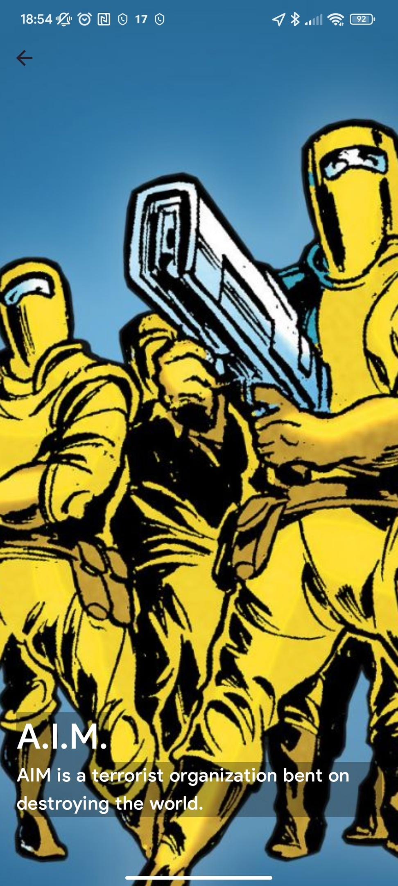
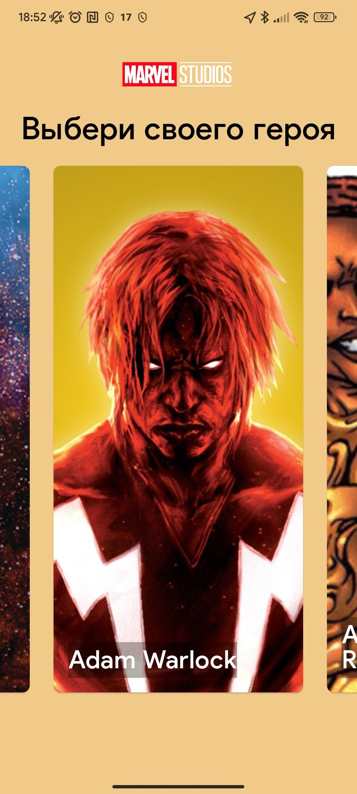
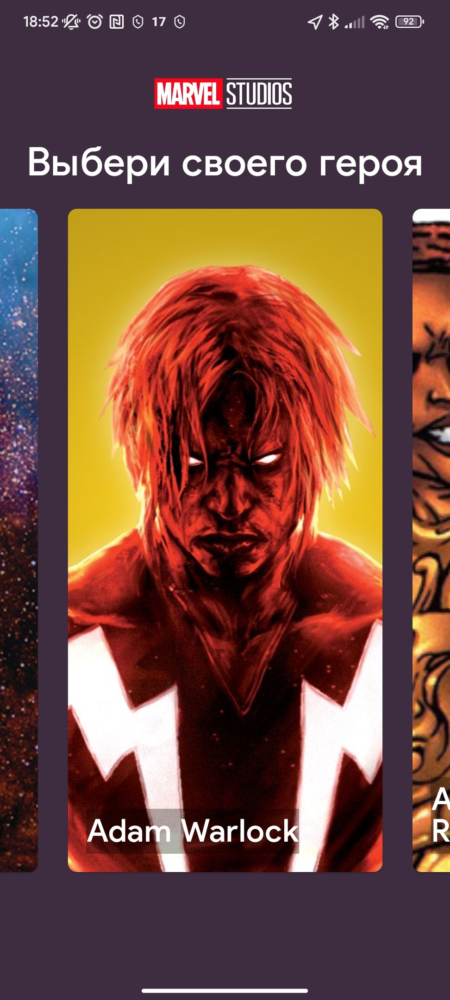

# Lab Project Effective Android

## About project

This repository contains <code>laboratory work</code> for students of the "Mobile Device Programming" course.

This project is designed to run on Android devices.

The application is a list of heroes from the Marvel universe.

It's a quite simple android app, but it demonstrates core features of the way we develop big and scalable production apps.

## How to use this sample
This sample includes some basic cases that are needed almost for any android app.

So, if you need to setup a new project, it can help you as an example how everything should work overall.

**It's not a bootstrap project, don't use it as a template to start from.**

## Screenshots

### Main screens

|Heroes List                   |Hero Details               |
|:----------------------------:|:---------------------------:|
|||

### Theming

|Light Theme                   |Dark Theme                   |
|:----------------------------:|:---------------------------:|
||| 

## Topics
* DI
* Navigation
* Architecture
* Theming
* Network
* Databse
* Firebase Cloud Messages
* Compose Based UI
* Gradle Configuration

## How to run
* You need Android Studio (at least Arctic Fox) with Kotlin plugin (at least 1.7.20)
* Add `PrivateAPIKey=<YourPrivateKey>` and `PublicAPIKey=<YourPublicKey>` in `local.properties` file. Your keys can get here: <a href="https://developer.marvel.com/">https://developer.marvel.com/</a>
* Run -> Run 'app'

## Known issues
* The used API has quite hard limits for developers
